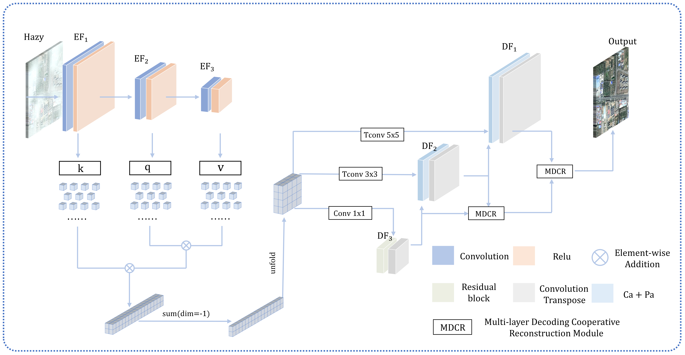
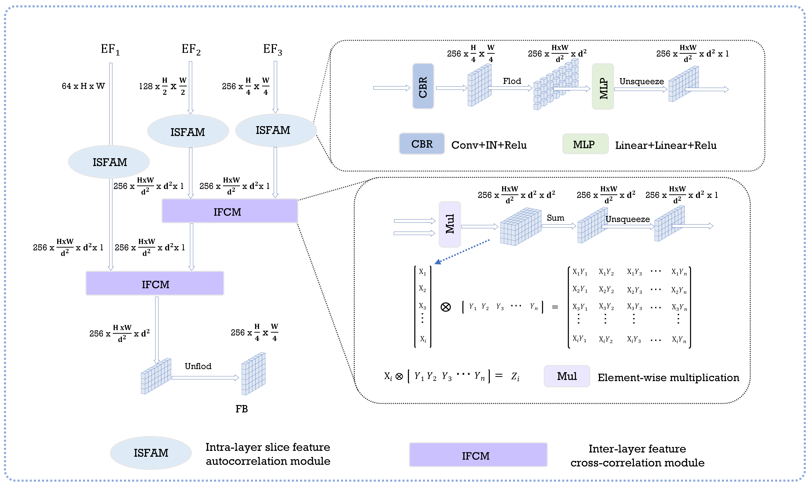
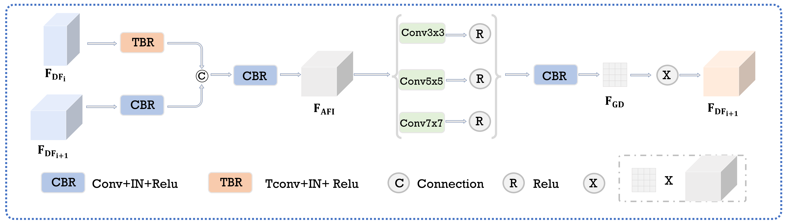

# HSMR-Net
Recently, U-shaped neural networks have gained widespread application in remote sensing image dehazing and achieved promising performance. However, most of the existing U-shaped dehazing networks neglect the global and local information interaction across layers during the encoding phase, which leads to incomplete utilization of the extracted features for image restoration. Moreover, in the process of image reconstruction, utilizing only the information from the terminal layers of the decoding phase for haze-free image restoration leads to a dilution of semantic information, resulting in color and texture deviations in the dehazed image. To address these issues, We propose a Hierarchical Slice Information Interaction and Multi-layer Decoding Collaborative Reconstruction dehazing network(HSMR-Net). Specifically, a Hierarchical Slice Information Interaction Module(HSIIM) is proposed to introduce Intra-layer feature autocorrelation and Inter-layer feature cross-correlation to facilitate global and local information interaction across layers, thereby enhancing the encoding features representation capability and improving the network’s dehazing performance. Furthermore, a Multi-layer Decoding Collaborative Reconstruction module(MDCR) is proposed to fully utilize feature information in each decoding layer, mitigate semantic information dilution, and improve the network’s capability to restore image colors and textures. The experimental results demonstrate that our HSMR-Net outperforms several state-of-the-art methods in dehazing on two publicly available datasets.
<!-- PROJECT SHIELDS -->

[![Contributors][contributors-shield]][contributors-url]
[![Forks][forks-shield]][forks-url]
[![Stargazers][stars-shield]][stars-url]
[![Issues][issues-shield]][issues-url]


<!-- PROJECT LOGO -->
<br />

<p align="center">
  <a href="https://github.com/xushouyi1/HSMR-Net/">
    
  </a>
  <h3 align="left">Hierarchical Slice Information Interaction and Multi-layer Decoding Collaborative Reconstruction dehazing network</h3>
  <p align="center">
  <a href="https://github.com/xushouyi1/HSMR-Net/">
    
  </a>
  </p>
  <h3 align="center">Hierarchical Slice Information Interaction module</h3>
  <p align="center">
  <a href="https://github.com/xushouyi1/HSMR-Net/">
    
  </a>
  </p>
  <h3 align="center">Multi-layer Decoding Collaborative Reconstruction module</h3>
  <p align="center">
    <br />
    <a href="https://github.com/xushouyi1/HSMR-Net/"><strong>Exploring the documentation for HSMR-Net »</strong></a>
    <br />
    <br />
    <a href="https://github.com/xushouyi1/HSMR-Net/">Check Demo</a>
    ·
    <a href="https://github.com/xushouyi1/HSMR-Net/">Report Bug</a>
    ·
    <a href="https://github.com/xushouyi1/HSMR-Net/">Pull Request</a>
  </p>

</p>

## Contents
- [Dependencies](#dependences)
- [Filetree](#filetree)
- [Pretrained Model](#pretrained-weights-and-dataset)
- [Train](#train)
- [Test](#test)
- [Clone the repo](#clone-the-repo)
- [Qualitative Results](#qualitative-results)
  - [Results on Statehaze1k-Thin remote sensing Dehazing Challenge testing images:](#results-on-statehaze1k-thin-remote-sensing-dehazing-challenge-testing-images)
  - [Results on Statehaze1k-Moderate remote sensing Dehazing Challenge testing images:](#results-on-statehaze1k-moderate-remote-sensing-dehazing-challenge-testing-images)
  - [Results on Statehaze1k-Thick remote sensing Dehazing Challenge testing images:](#results-on-statehaze1k-thick-remote-sensing-dehazing-challenge-testing-images)
  - [Results on HRSD-DHID remote sensing Dehazing Challenge testing images:](#results-on-hrsd-dhid-remote-sensing-dehazing-challenge-testing-images)
  - [Results on HRSD-LHID remote sensing Dehazing Challenge testing images:](#results-on-hrsd-lhid-remote-sensing-dehazing-challenge-testing-images)
  - [Copyright](#copyright)
- [Thanks](#thanks)

### Dependences

1. Pytorch 1.8.0
2. Python 3.7.1
3. CUDA 11.7
4. Ubuntu 18.04
### Filetree

```
├── README.md
├── /HSMR-Net/
|  ├── train.py
|  ├── test.py
|  ├── Model.py
|  ├── Model_util.py
|  ├── perceptual.py
|  ├── train_dataset.py
|  ├── test_dataset.py
|  ├── utils_test.py
|  ├── make.py
│  ├── /pytorch_msssim/
│  │  ├── __init__.py
│  ├── /datasets_train/
│  │  ├── /hazy/
│  │  ├── /clean/
│  ├── /datasets_test/
│  │  ├── /hazy/
│  │  ├── /clean/
│  ├── /output_result/
└── /images/
```
### Pretrained Weights and Dataset

Download our model weights on geogle cloud disk: https://pan.baidu.com/s/1dePHGG4MYvyuLW5rZ0D8VA?pwd=lzms

Download our test datasets on geogle cloud disk: https://pan.baidu.com/s/1HK1oy4SjZ99N-Dh-8_s0hA?pwd=lzms

Download our model weights on Baidu cloud disk: https://pan.baidu.com/s/1dePHGG4MYvyuLW5rZ0D8VA?pwd=lzms

Download our test datasets on Baidu cloud disk: https://pan.baidu.com/s/1HK1oy4SjZ99N-Dh-8_s0hA?pwd=lzms
### Train

```shell
python train.py -train_batch_size 4 --gpus 0 --type 5
```

### Test

 ```shell
python test.py --gpus 0 --type 5

### Clone the repo
```sh
git clone https://github.com/xushouyi1/HSMR-Net.git
```

### Qualitative Results

#### Results on Statehaze1k-Thin remote sensing Dehazing Challenge testing images
<div style="text-align: center">

</div>

#### Results on Statehaze1k-Moderate remote sensing Dehazing Challenge testing images
<div style="text-align: center">

</div>

#### Results on Statehaze1k-Thick remote sensing Dehazing Challenge testing images
<div style="text-align: center">

</div>

#### Results on HRSD-LHID remote sensing Dehazing Challenge testing images
<div style="text-align: center">

</div>

#### Results on HRSD-DHID remote sensing Dehazing Challenge testing images
<div style="text-align: center">

</div>


### Thanks


- [GitHub Emoji Cheat Sheet](https://www.webpagefx.com/tools/emoji-cheat-sheet)
- [Img Shields](https://shields.io)
- [Choose an Open Source License](https://choosealicense.com)
- [GitHub Pages](https://pages.github.com)


<!-- links -->
[your-project-path]:thislzm/PSMB-Net
[contributors-shield]: https://img.shields.io/github/contributors/xushouyi1/HSMR-Net.svg?style=flat-square
[contributors-url]: https://github.com/xushouyi1/HSMR-Net/graphs/contributors
[forks-shield]: https://img.shields.io/github/forks/xushouyi1/HSMR-Net.svg?style=flat-square
[forks-url]: https://github.com/thislzm/xushouyi1/HSMR-Net/members
[stars-shield]: https://img.shields.io/github/stars/xushouyi1/HSMR-Net.svg?style=flat-square
[stars-url]: https://github.com/xushouyi1/HSMR-Net/stargazers
[issues-shield]: https://img.shields.io/github/issues/xushouyi1/HSMR-Net.svg?style=flat-square
[issues-url]: https://img.shields.io/github/issues/xushouyi1/HSMR-Net.svg
[license-shield]: https://img.shields.io/github/license/xushouyi1/HSMR-Net?style=flat-square
[linkedin-shield]: https://img.shields.io/badge/-LinkedIn-black.svg?style=flat-square&logo=linkedin&colorB=555
[linkedin-url]: https://linkedin.com/in/shaojintian
